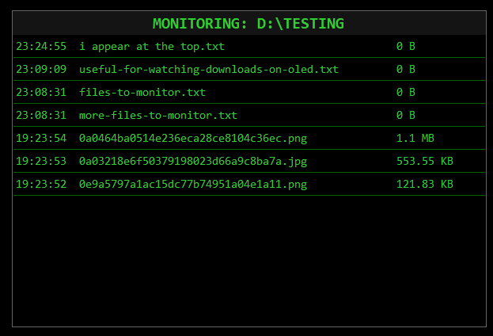

# download-watcher-screensaver
A Windows screensaver that monitors a specific directory (e.g., Downloads) and visualizes file activity in a retro "DVD bounce" style interface.

## Features
- Real-time monitoring of file creation and modification.
- Configurable directory path and movement speed.
- Settings stored in User AppData.

## Prerequisites
To build this project, you need the .NET 8 SDK.

**Install via Winget:**
```powershell
winget install Microsoft.DotNet.SDK.8
```

## Building
1. Open a terminal in the project directory.
2. Run the publish command to create a single-file executable:

```powershell
dotnet publish -c Release -r win-x64 --self-contained false /p:PublishSingleFile=true -o ./publish
```
*Note: Change `--self-contained false` to `true` if you want to bundle the .NET runtime inside the screensaver (larger file size, but no separate .NET installation required on the target machine).*

## Installation
1. Navigate to the `publish` folder created in the previous step.
2. Locate `FileWatcherSaver.exe`.
3. Rename the file extension from `.exe` to `.scr` (e.g., `FileWatcherSaver.scr`).
4. Right-click `FileWatcherSaver.scr` and select **Install**.
   - This will open the Windows Screen Saver Settings dialog with this screensaver selected.
5. Click **Settings...** to configure the folder to monitor and animation speed.
6. Click **Apply** or **OK** to set it as your active screensaver.

## Example

